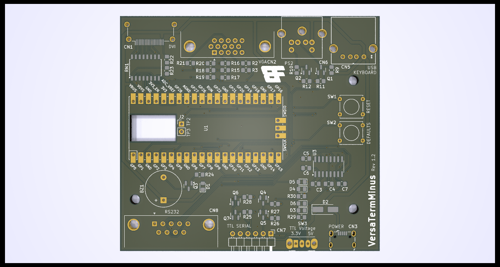

# VersaTermMinus

Reduced and simplified version of David Hansel's VersaTerm
project [github.com/dhansel/VersaTerm](https://github.com/dhansel/VersaTerm)

## Changes to the Original Design

There are four significant changes to the board:

1. The barrel-jack power supply connection is deleted
2. The USB socket for keyboard is now micro-USB
3. The MAX3232 is integrated into the board
4. Where possible components are SMD

The changes allow the board to be reduced in size and cost.

## Assembly

It is highly recommended to use a stencil and
hot plate for mounting the SMD components. If
assembling by hand, start with the MAX232 chip
and resistor pack. It is important to mount the
small resistors, capacitors and diodes before
adding the HDMI, USB and large through-hole
components. Failing to do those first will make
assembly much harder.

If you want to use the USB keyboard option a
pair of wires needs to be attached to TP2 and
TP3 on the underside of the Pico board, and
connected to the J2 position on the main board.
Pin 1 of J2 should be connected to TP2.

### 1n4148 Diodes

The board uses a regular 0805 footprint for the
smaller 1n4148 diodes but it may prove easier
to source SOD323. These still fit easily on the
0805 footprint.

## Firmware

The pico board should be loaded with the 
original VersaTerm firmware from David Hansel's
git repository: [VersaTerm uf2 firmware](https://github.com/dhansel/VersaTerm/blob/main/software/VersaTerm.uf2)

## Errors on Early Fabricated Boards

On the first run of the board the traces to
the RS232 DE9 connector were incorrect. To fix
the error it is necessary to cut three of the
traces running from the MAX232 chip to the DE9.

With the DE9 nearest you the top three diagonal
traces running from top right to bottom left
need to be cut.

Three wires then need soldering to the upper two
pins of the DE9 and the lower middle (Pins 2, 3
and 8 of the connector). These need to be wired
to the MAX3232 on pins 5, 15 and 16.

DE9 pin 8 -> MAX3232 pin 16  
DE9 pin 2 -> MAX3232 pin 5  
DE9 pin 3 -> MAX3232 pin 15

To keep the fix tidy I drilled a hold through
the PCB above the right hand edge of the DE9
and below the visible traces on the top of the
board. This allows shorter, more direct
connections to be made.
